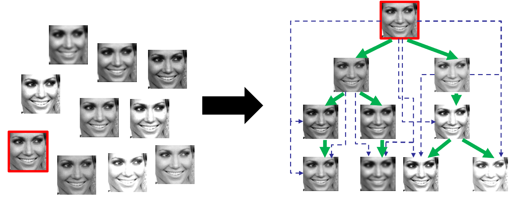

# Detecting Near-Duplicates Using Graph Neural Networks and Sensor Pattern Noise

This is a Tensorflow and MATLAB R2018a implementation of detection of near-duplicate face images using graph neural network and sensor pattern noise. The implementation of the graph neural network is adopted from https://github.com/tkipf/gcn See their paper for details about graph convolutional neural network.

## Objective

The objective of this work is to detect the original image from a set of near-duplicates. These near-duplicates belong to the same individual but have been digitally modified usign different image editing tools. The original image is also known as the root node. Further, we also deduce the hierarchical relationship between the near-duplicates and represent it in the form of an image phylogeny tree, also known as IPT.   



## Requirements
* MATLAB R2018a (should run on higher versions also but I have not confirmed it)
* Tensorflow >0.12 (should be compatible with higher versions but check for deprecations) 
* Networkx

## Folder organization

* `Filter` and `Functions` contains C++ compiled files for Sensor Pattern Noise (SPN)- PRNU computation from images
(http://dde.binghamton.edu/download/camera_fingerprint/)

## Steps to run the scripts

Please follow the steps to ensure you first prepare the data to be fed as inputs to the graph neural network, followed by running the node mebedding module and finally the link prediction module

* For data preprocessing and preparation use
```bash
PixelandPRNUFeatures_TrainingSet.m
```
```bash
PixelandPRNUFeatures_TestSetNDFI.m
```
```bash
GNN_Inputs_NDFI.m
```
Run the above scripts in the order mentioned to extract pixel intensity and sensor pattern noise features form the training set and the testing set. Then run `GNNInputs_NDFI.m` to prepare the data in the format suitable for GNN. 

* For depth label prediction using GNN use
```bash
Nodeembedding.py
```
Run the above script to get the depth label predictions from the graph neural network. Read the script and you can provide `gcn` and `gcn_cheby` to select between ChebNet and GCN. The order of the Chebyshev polynomials can be provded as an input argument. We have used 3rd order Chebsyhev polynomial as it is giving us the best results.   

* For link prediction using sensor pattern noise use
```bash
Linkprediction.m
```
Run the above script to construct the IPT using depth labels prodcued by `Nodeembedding.py` and the sensor pattern noise extarcted using `PixelandPRNUFeatures_TestSetNDFI.m`.  

## Helper functions (Read the comments included in individual helper functions for better understanding)

* `inits.py`,`models.py`,`metrics.py`,`utils.py`, `layers.py` : These functions are required for the GNN based node embedding module

* `PhaseNoiseExtractfromImage.m`,`PhaseNoiseExtract.m` : These functions are required for extracting Enhanced sensor pattern noise (PRNU) from the images

## Notes

* The scripts provided are generated using training images form the Labeled Faces in the Wild Datset http://vis-www.cs.umass.edu/lfw/ and test images from Near-Duplicate Face Images - Set I http://iprobe.cse.msu.edu/dataset_detail.php?id=1&?title=Near-Duplicate_Face_Images_(NDFI) You can use any other test set

* We used Enhanced PRNU for sensor pattern nosie extraction. See the paper C. T. Li, "Source Camera Identification Using Enhanced Sensor Pattern
Noise," IEEE T-IFS 2010

## References

Please read our previous work to learn more about the face phylogeny:

```
@inproceedings{TBIOM2020_FacePhylo,
  title={Face Phylogeny Tree USing Basis Functions},
  author={Banerjee, Sudipta and Ross, Arun},
  booktitle={IEEE Transactions on Biometrics, Behavior and Identity Science (T-BIOM)},
  volume={2},
  issue={4},
  pages={310-325}.
  year={2020}
}
```

```
@inproceedings{BTAS2019_FacePhylo,
  title={Face Phylogeny Tree: Deducing Relationships Between Near-Duplicate Face Images Using Legendre Polynomials and Radial Basis Functions},
  author={Banerjee, Sudipta and Ross, Arun},
  booktitle={IEEE 10th International Conference on Biometrics Theory, Applications and Systems (BTAS)},
  year={2019}
}
```

